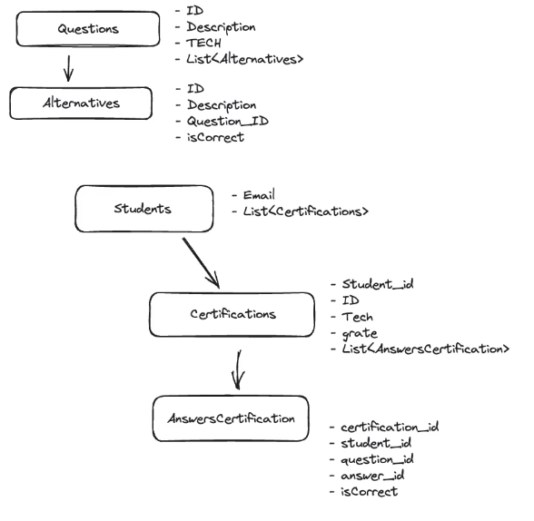

#  Projeto realizado durante o evento nlw Expert Java da [Rocketseat](https://www.rocketseat.com.br/)


Desenvolvimento de uma aplicação completa com Springboot, onde o estudante insere o e-mail e a tecnologia, consegue realizar uma prova e conquistar sua certificação com a nota inserida e por fim teremos um ranking dos 10 melhores alunos.

---

## ✅ Estrutura inicial


---

## ⚙️ Funcionalidades
- [Listar as questões e suas respectivas alternativas](#listar-alternativas)<a name="retornar-ao-índice"></a>
- [Verificar se o estudante já possui uma certificação](#verificar-certificacao)
- [Realizar prova](#relizar-prova)
- [Ranking Top 10](#ranking-top10)

---

## 📌 Endpoints
`GET` `/questions/technology/{technology}` <a name="listar-alternativas"></a>
> Inserimos a tecnologia que queremos obter a certificação

Exemplo de resposta: JAVA

Contendo 3 questões e 4 alternativas cada pergunta

```JSON
[
    {
        "id": "c5f02721-6dc3-4fa6-b46d-6f2e8dca9c66",
        "technology": "JAVA",
        "description": "Como criar uma classe em Java?",
        "alternatives": [
            {
                "id": "bafdf631-6edf-482a-bda9-7dce1efb1890",
                "description": "Usando a palavra-chave \"class\""
            },
            {
                "id": "98f6891b-5f14-4b8e-bb87-46456a2610d4",
                "description": "Definindo uma interface em Java"
            },
            {
                "id": "993a7d37-62a0-4040-810d-d667e3f7a891",
                "description": "Utilizando métodos estáticos"
            },
            {
                "id": "98bf8d0f-dc1c-4db0-b09c-94246089aa02",
                "description": "Criando um construtor padrão"
            }
        ]
    },
    {
        "id": "b0ec9e6b-721c-43c7-9432-4d0b6eb15b01",
        "technology": "JAVA",
        "description": "Explique o conceito de polimorfismo em Java.",
        "alternatives": [
            {
                "id": "1da0f5dd-7a02-4c34-8c60-4648b55141f2",
                "description": "Herança simples"
            },
            {
                "id": "c4fd1c23-8993-4972-92d5-b8364b78d1cf",
                "description": "Encapsulamento em Java"
            },
            {
                "id": "9da03a4e-3c8d-4a32-87e1-9898938435c2",
                "description": "Sobrecarga de métodos"
            },
            {
                "id": "f8e6e9b3-199b-4f0d-97ce-7e5bdc080da9",
                "description": "Capacidade de um objeto de assumir várias formas"
            }
        ]
    },
    {
        "id": "f85e9434-1711-4e02-9f9e-7831aa5c743a",
        "technology": "JAVA",
        "description": "Como lidar com exceções em Java?",
        "alternatives": [
            {
                "id": "3528a132-9c12-4c8a-aa93-9f6e813c43d1",
                "description": "Ignorando a exceção"
            },
            {
                "id": "d3e51a56-9b97-4bb8-9827-8bcf89f4b276",
                "description": "Utilizando blocos try-catch"
            },
            {
                "id": "63c0210c-2a9a-4e93-98ec-8d9f3984e2b0",
                "description": "Declarando uma exceção sem tratamento"
            },
            {
                "id": "e4dbf524-0a54-428a-b57c-853996fc8e19",
                "description": "Usando a palavra-chave \"finally\""
            }
        ]
    }
]
```
[](#retornar-ao-índice)

`POST` `/students/verifyIfHasCertification` <a name="verificar-certificacao"></a>
> Verifica se o estudante já possui uma certificação

Exemplo de requisição:

```JSON
{
    "email": "usuario@email.com",
    "technology": "JAVA"
}
````

Exemplo de resposta, caso o aluno não tenha realizado a prova:

```
Usuário pode fazer a prova
```

Exemplo de resposta, caso o aluno já tenha realizado a prova:

```
Usuário já fez a prova
```
[](#retornar-ao-índice)

`POST` `/students/certification/answer` <a name="relizar-prova"></a>
> Insere as respostas do aluno

Exemplo de requisição:

```JSON
{
    "email": "usuario@email.com",
    "technology": "JAVA",
    "questionsAnswers": [
        {
            "questionID": "c5f02721-6dc3-4fa6-b46d-6f2e8dca9c66",
            "alternativeID": "bafdf631-6edf-482a-bda9-7dce1efb1890"
        },
        {
            "questionID": "b0ec9e6b-721c-43c7-9432-4d0b6eb15b01",
            "alternativeID": "c4fd1c23-8993-4972-92d5-b8364b78d1cf"
        },
        {
            "questionID": "f85e9434-1711-4e02-9f9e-7831aa5c743a",
            "alternativeID": "d3e51a56-9b97-4bb8-9827-8bcf89f4b276"
        }
    ]
}
```

Exemplo de resposta, caso o aluno não tenha realizado a prova:

```JSON
{
    "id": "d4659d81-071f-4d75-b82e-5d67c69540bf",
    "technology": "JAVA",
    "grade": 2,
    "studentID": "f432b909-c6bc-4377-b83f-54f12b400ca6",
    "studentEntity": null,
    "answersCertificationsEntities": [
        {
            "id": "e2e94c33-09ec-4942-b277-d918270c0aff",
            "certificationID": "d4659d81-071f-4d75-b82e-5d67c69540bf",
            "studentID": null,
            "studentEntity": null,
            "questionID": "c5f02721-6dc3-4fa6-b46d-6f2e8dca9c66",
            "answerID": "bafdf631-6edf-482a-bda9-7dce1efb1890",
            "createdAt": "2024-02-10T15:14:48.754946",
            "correct": true
        },
        {
            "id": "93c5059e-2c72-4d73-9ab6-5f7b5e5f638f",
            "certificationID": "d4659d81-071f-4d75-b82e-5d67c69540bf",
            "studentID": null,
            "studentEntity": null,
            "questionID": "b0ec9e6b-721c-43c7-9432-4d0b6eb15b01",
            "answerID": "c4fd1c23-8993-4972-92d5-b8364b78d1cf",
            "createdAt": "2024-02-10T15:14:48.759594",
            "correct": false
        },
        {
            "id": "9c41ce94-42c3-44ae-9791-143444ceffce",
            "certificationID": "d4659d81-071f-4d75-b82e-5d67c69540bf",
            "studentID": null,
            "studentEntity": null,
            "questionID": "f85e9434-1711-4e02-9f9e-7831aa5c743a",
            "answerID": "d3e51a56-9b97-4bb8-9827-8bcf89f4b276",
            "createdAt": "2024-02-10T15:14:48.768354",
            "correct": true
        }
    ],
    "createdAt": "2024-02-10T15:14:48.705219"
}
```

Exemplo de resposta, caso o aluno já tenha realizado a prova:

```
Você já tirou sua certificação!
```
[](#retornar-ao-índice)

`GET` `/ranking/top10` <a name="ranking-top10"></a>
> Mostra os 10 melhores alunos de acordo com a nota (grade)

Exemplo com apenas 5 provas realizadas, mostra os resultados de forma decrescente:

```JSON
[
    {
        "id": "952fc595-0ccc-4ea8-881b-32184e4ad3b7",
        "technology": "JAVA",
        "grade": 3,
        "studentID": "8d54c337-1fd7-4004-bf90-4081df92cec6",
        "studentEntity": {
            "id": "8d54c337-1fd7-4004-bf90-4081df92cec6",
            "email": "usuario3@email.com",
            "createdAt": "2024-02-10T13:16:18.74172"
        },
        "answersCertificationsEntities": [],
        "createdAt": "2024-02-10T13:16:18.861582"
    },
    {
        "id": "cd0d5f12-0462-4966-bc82-b84a05a20144",
        "technology": "JAVA",
        "grade": 2,
        "studentID": "6aa29b67-c9ab-4747-9b54-197299db7f3e",
        "studentEntity": {
            "id": "6aa29b67-c9ab-4747-9b54-197299db7f3e",
            "email": "usuario@email.com",
            "createdAt": "2024-02-10T12:21:55.238281"
        },
        "answersCertificationsEntities": [],
        "createdAt": "2024-02-10T12:21:55.289918"
    },
    {
        "id": "e37175b9-c12b-49c6-b0e5-6c871c34527d",
        "technology": "JAVA",
        "grade": 2,
        "studentID": "464a4af0-870f-411b-ba5c-d6519654f440",
        "studentEntity": {
            "id": "464a4af0-870f-411b-ba5c-d6519654f440",
            "email": "usuario2@email.com",
            "createdAt": "2024-02-10T12:22:05.156852"
        },
        "answersCertificationsEntities": [],
        "createdAt": "2024-02-10T12:22:05.188836"
    },
    {
        "id": "05a8ef52-c8e5-48cf-a566-97874026c4cf",
        "technology": "JAVA",
        "grade": 1,
        "studentID": "8d7a66e7-461b-4f18-b187-78f64b091f42",
        "studentEntity": {
            "id": "8d7a66e7-461b-4f18-b187-78f64b091f42",
            "email": "usuario5@email.com",
            "createdAt": "2024-02-10T15:14:18.462108"
        },
        "answersCertificationsEntities": [],
        "createdAt": "2024-02-10T15:14:18.760386"
    },
    {
        "id": "d4659d81-071f-4d75-b82e-5d67c69540bf",
        "technology": "JAVA",
        "grade": 0,
        "studentID": "f432b909-c6bc-4377-b83f-54f12b400ca6",
        "studentEntity": {
            "id": "f432b909-c6bc-4377-b83f-54f12b400ca6",
            "email": "usuario4@email.com",
            "createdAt": "2024-02-10T15:14:48.606896"
        },
        "answersCertificationsEntities": [],
        "createdAt": "2024-02-10T15:14:48.705219"
    }
]
```
[](#retornar-ao-índice)

---

## 💡 Como contribuir para o projeto

1. Faça um **fork** do projeto.
2. Crie uma nova branch com as suas alterações: `git checkout -b my-feature`
3. Salve as alterações e crie uma mensagem de commit contando o que você fez: `git commit -m "feature: My new feature"`
4. Envie as suas alterações: `git push origin my-feature`

---

## 🧙🏽‍♀️ Autora

<a href="https://www.linkedin.com/in/gessycaborges/">
 <br />
 <sub><a>Gessyca Borges</a></sub></a> <a href="https://www.linkedin.com/in/gessycaborges/" title="Gessyca">✨</a>
 <br />

 ---
